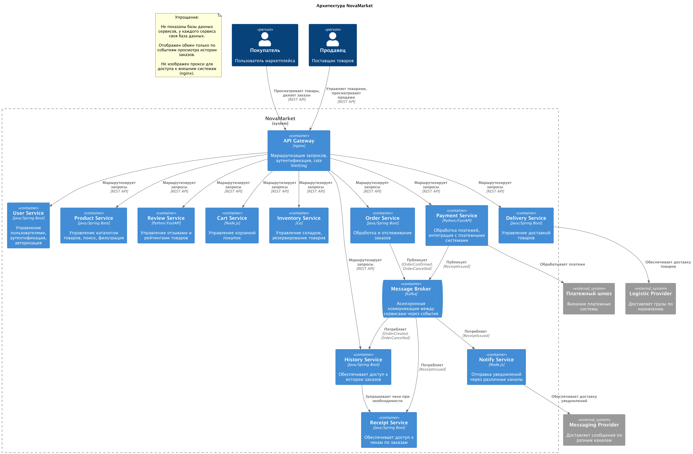

# ADR1: Реализация просмотра истории покупок для NovaMarket

Автор: Кудрин О.А.
Дата: 13.10.2025

## Контекст

Проект маркетплейса NovaMarket расширяется, количество покупателей растет, ограниченные возможности по просмотру истории заказов сдерживают развитие.

## Требования

Необходимо реализовать для покупателей быстрый и исчерпывающий доступ к истории заказов из личного кабинета.

### Функциональные требования

1) В общем списке заказов отображается:

    - когда сделан заказ,
    - сколько заказ стоил,
    - каким способом доставлен.

2) Для каждого заказа можно открыть подробную информацию:

    - список товаров,
    - количество по каждому товару,
    - цена по каждому товару,
    - итоговая сумма,
    - способ доставки,
    - способ оплаты,
    - финальный статус заказа (доставлен, отменён).

3) Покупатель может скачать чек по заказу.

4) Покупатель может оставить отзыв о товаре.

5) Покупатель может заказать товар снова.

### Нефункциональные требования

Отклик на запросы по истории заказов должен быть минимальным:

- Не более 1,0 секунды в 99,99%
- Не более 0,3 секунды в 98%

## Решение

### History Service

Для хранения истории по заказам создадим сервис History Service, который будет накапливать информацию по завершенным заказам. Применим базу данных для быстрой выборки заранее структурированной информации (MongoDB). Срок хранения заказов в сервисе истории будет существенно больше, чем в основном сервисе заказов. С помощью сервиса истории реализуем паттерн CQRS (Command Query Responsibility Segregation), при котором разделяются команды и запросы, на запросы отвечает сервис истории, разгружая основные сервисы для обработки текущих заказов (команд).

Если увеличить срок хранения событий по заказам в Kafka можно реализовать более детальное исследование по обработке конкретных заказов, таким образом реализуя паттерн Event Sourcing. Функциональные требования этого не содержат, но потенциально, пусть на меньшую глубину, можно извлекать подробную информацию по эволюции заказа.

Со временем можно расширить набор собираемой информации History Service, подписавшись на события других сервисов.

### Receipt Service

Для хранения чеков создадим сервис Receipt Service, который будет хранить чеки необходимое время. В этом сервисе применим специальную базу данных для хранения чеков. Разгрузим основной сервис Payment Service от запросов по чекам.

Добавим новое событие ReceiptIssued, которое публикует Payment Service после формирования чека, это событие читает Notify Service, чтобы отправить чек покупателю, а также Receipt Service, чтобы сохранить его для хранения.

Доступ к чекам будет предоставлять сервис History Service опосредованно, делая внутренний запрос к сервису Receipt Service (применяем паттерн API Composition).

### Прочие требования

Повторный заказ осуществляется как обычно, через Order Service.

Добавление отзывов по товарам осуществляется как обычно, через Review Service.

## Альтернативы

Вариант наращивать мощность сервиса Order Service, чтобы он мог быстро выдавать информацию по заказам, отклонен, как бесперспективный. Также с чеками и сервисом Payment Service. Решено создать новые специализированные сервисы.

Можно было бы предоставить прямой доступ к сервису Receipt Service, но решено оставить его внутренним, и предоставить опосредованный доступ через HistoryService.

## Недостатки, ограничения, риски

Новые сервисы потребуют затрат на создание и эксплуатацию, при том что базовая функциональность уже есть в Order Service и Payment Service.
